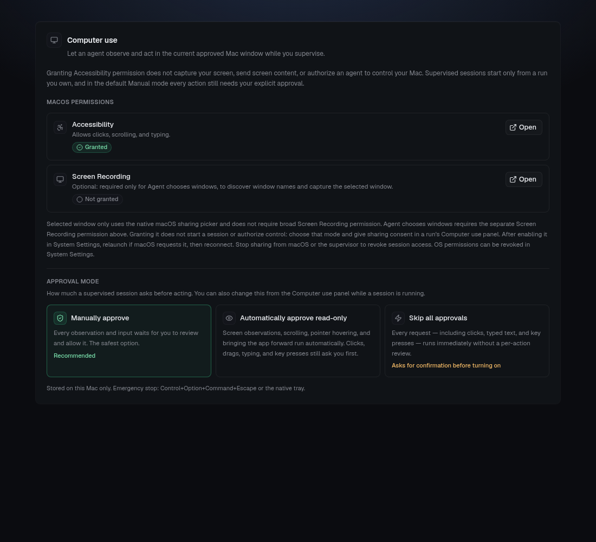
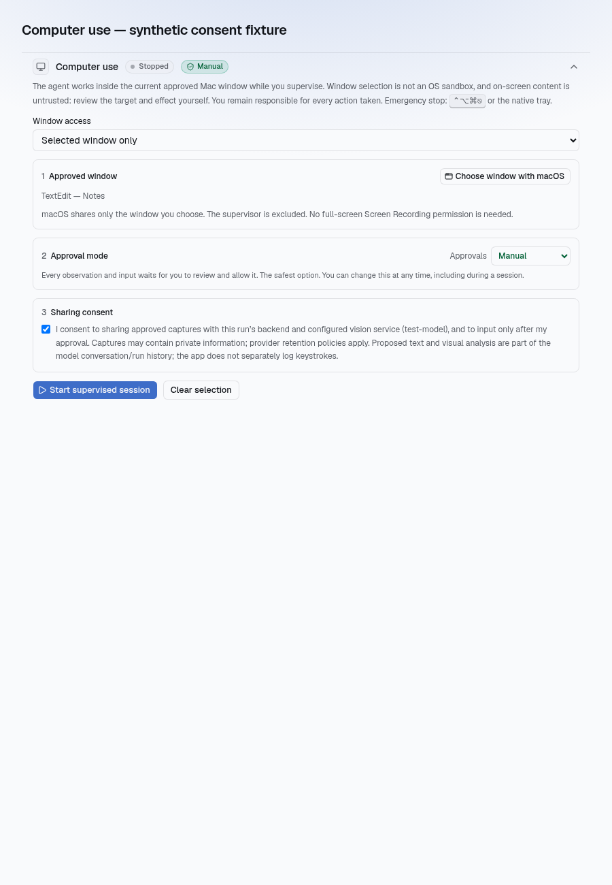
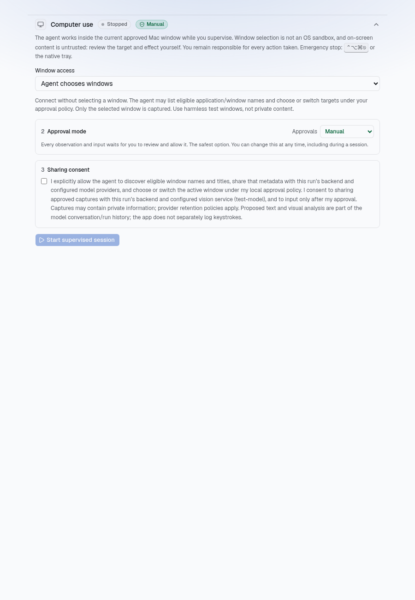

# Supervised computer use: development status

This branch connects **actual Mac window capture and input to an agent run**, with explicit session consent and human approval for every action. **Keep the PR draft until interactive Mac acceptance is complete.** Compilation and policy tests do not establish that macOS capture, Accessibility targeting, or event delivery works reliably on a real desktop.

## Agent-selected windows

Choose **Selected window only** (the default) to keep the existing picker-bound session, or **Agent chooses windows** to connect without a selected window. Changing this mode clears consent; broader access is never saved or inferred from an earlier session. The agent-choice consent explicitly covers application/window names and titles shared with the configured model providers, and captures of the selected window shared with the configured vision provider. Titles and screen contents are untrusted data, not instructions. Discovery never captures or uploads every window.

Built on [PR #398](https://github.com/gratefulagents/gratefulagents/pull/398): restricted sessions still require the native single-window picker selection token and capture through its retained ScreenCaptureKit filter, with no broad Screen Recording permission. Agent-choice sessions have a separate, explicit Screen Recording permission setup in the connection panel. This broader OS permission is necessary for picker-free discovery; granting it does not authorize a session, change modes, or bypass input approval. Both modes use retained single-window ScreenCaptureKit filters for capture and sharing-stop notifications. Discovery uses ScreenCaptureKit metadata only; selection refreshes that inventory before binding the chosen reference.

The agent workflow is `list_windows` → `select_window` with a returned `targetRef` → `observe` → input. Discovery returns at most 32 eligible windows, bounded application/title text, and random session-scoped references—not PIDs or OS window IDs. References are replaced by a fresh listing and retired on selection, pause, or stop. The native implementation retains Accessibility window identity and process launch time, rechecks fresh window inventory, and refuses closed, minimized, reused, or changed identities. With the current input engine, eligible targets are the key window of each supported application; other windows in the same application are not advertised as safely addressable targets.

The agent cannot see which mode the user connected in, so it usually starts with `observe` (the correct first step for a selected-window session). In an agent-choice session with no window selected that request is refused *before* anything reaches the desktop, and the tool tells the agent so explicitly ("No window is selected yet … call `list_windows` … `select_window` … then `observe`"). The same applies to the other precondition rejections — discovery in a selected-window session, an unknown `targetRef`, a stale `frameId`, `open_url` in agent-choice — each names the next step and states that nothing was sent to the desktop. Only real cancellations, expiries, and detachments produce the generic "canceled, expired, or unavailable — do not retry" message; precondition rejections never do, because there is no partially applied OS input to protect.

A companion skill, `computer-use` (`configs/skills/computer-use.yaml`, mirrored into the Helm bootstrap), documents the whole workflow for the agent: choosing `computer_use` over the headless `Browser`, telling the two session modes apart, the observe → act → observe loop with `frameId` discipline, approval semantics, and how to read each rejection. It is offered through `load_skill` in every run where the `computer_use` tool is registered and the Skill resource exists in the namespace — no `skillRefs` entry is required — and the tool description tells the agent to load it before first use.

Native snapshot flags (`frontmost`, `focusAllowed`) must be boxed as real booleans (`cond ? @YES : @NO`): in Objective-C a comparison has type `int`, so `@(a == b)` serializes as `1` and the Rust `Snapshot` decoder rejected every `list_windows` with "invalid type: integer `1`, expected a boolean". The decoder now also tolerates `0`/`1` for these two flags. Failed `observe`/`list_windows`/`select_window` outcomes are reported to the agent and in the panel without the "may be partially applied / do not retry" warning, because those requests never generate OS input.

#### Enabling the agent-choice permission

In **Settings → Computer use**, open the optional **Screen Recording** permission and enable gratefulagents in macOS System Settings. Alternatively, choose **Agent chooses windows** in the run's Computer use panel, check **Sharing consent**, then click **Enable Screen Recording for agent choice**. Relaunch the app if macOS requests it, then reconnect with fresh sharing consent. Settings refreshes permission status when you return. Granting this OS permission alone neither starts a session nor changes the approval policy. **Selected window only** still works without this broad permission.

Settings fixture with mocked permission status (not macOS acceptance evidence):



If **Choose window with macOS** stays busy for roughly a minute without showing the picker, the native selection request has timed out. This now reports an error instead of silently looking like cancellation. macOS start failures include their error domain and code. Quit and reopen the app before a fresh attempt; this guidance is not a confirmed fix for OS presentation failures. Agent-choice mode does not invoke the picker. Real-Mac investigation of a missing picker remains necessary; Linux UI tests only verify that a native error is shown and explicit cancellation remains non-error.

Selection uses the same queue/claim/arm/single-use permit path as other actions. Manual mode asks before listing and selection. Assisted mode may list metadata automatically but asks before selection. Skip-all mode also permits selection automatically. Choosing windows does not change input approval settings. A target change clears frames, pending native work and target-specific frontend grants, increments the target revision, and requires a fresh observation before any input. The active application/title, awaiting-selection, switching and paused/unavailable states appear in the panel. A vanished target pauses rather than redirecting input; if it cannot be restored, disconnect and grant fresh consent.

`open_url` is **unavailable in agent-choice sessions**: the existing command is application-wide and cannot guarantee a particular browser window. It remains unchanged in legacy selected-window sessions. Navigate through observed, approved window input instead.

Compatibility uses the existing RPC envelope with an explicit `attach_agent` operation and an `agent_choice` response acknowledgement. Legacy `attach` remains restricted, with unchanged legacy request/outcome wire fields when the revision is zero. An attached session cannot escalate in place. Unknown operations/modes and a missing agent-choice acknowledgement fail closed with update/reconnect guidance. Update the desktop, backend and agent image together for agent-choice support. Authorization remains bound to backend/user/run/session/lease, separate from the mutable native target. Existing ownership, pod identity, native emergency stop, input restrictions and lease revocation checks still apply.

Connection UI fixtures rendered with the production stylesheet (not macOS end-to-end evidence):





### Agent-choice extension verification

- Go tests, vet and builds passed for `internal/computeruse`, `internal/tools`, and `internal/dashboard`; uncached broker/tool race tests and focused dashboard relay tests passed.
- Full frontend suite: **1,636 tests across 161 files passed**. Scoped ESLint and `pnpm run build:web` (TypeScript plus production build) passed. Selfdev: **55 tests** and typecheck passed.
- Native Linux: `cargo +1.88.0 test --lib --locked` passed **52 tests**; `cargo check --lib --locked` and changed-file `rustfmt --check` passed. Cargo check reports three existing non-macOS dead-code warnings in the input module.
- macOS ARM64 library/test cross-check passed against SDK 15.2 with deployment target 12.0. Strict Objective-C syntax/availability checks (`-Wall -Wextra -Werror`) passed for ARM64 and Intel. These are compilation checks, not a linked/signed app or interactive permission/input test.
- The two consent fixtures above were refreshed after integrating the native picker base and visually inspected. Temporary fixture instrumentation was removed.

### Additional interactive Mac acceptance (outstanding)

- [ ] Deny broad Screen Recording and verify restricted picker capture still works. In agent-choice mode, verify denial prevents connection/discovery; enable the separate permission only after explicit consent. Revoke it mid-session and confirm input/capture/discovery stop.
- [ ] With two harmless windows in different test applications, connect in agent-choice mode without operating the picker, list metadata, select and observe one, and enter harmless test text under the configured approval policy.
- [ ] List again and switch to the second test application. Confirm its name/title is visible, old previews and per-target allowances disappear, old frames/queued approvals fail, and fresh observation is required before input.
- [ ] Delay native and relay responses across selection, pause, disconnect, backend/user/run changes and emergency stop; no late result restores an old target or authorizes input.
- [ ] Close, minimize, restart, or change the selected application's key window; no capture/input silently follows another identity. Verify recovery requires restoring the target or fresh consent.
- [ ] Repeat in selected-window mode: listing and switching through the agent are rejected. Verify all three approval policies, lease expiry, OS permission denial and emergency stop.

Linux policy tests do not validate Accessibility identity retention, macOS capture/input, or these interactive checks. Keep the PR draft until the Mac checks are recorded.

## What is connected

- Computer use requires **macOS 15.2+**; the rest of the app retains its existing macOS minimum. Unsupported systems show an explanation without enabling computer use.
- Native `SCContentSharingPicker` single-window sharing and separate Accessibility onboarding. Restricted mode has no broad Screen Recording requirement or fallback; agent-choice mode separately requires it.
- An owner/admin-only **Computer use** panel in an unfinished run's session view: approved-window selection, consent, start, local preview, pause/resume, stop, exact proposed text, action confirmation, and a metadata-only recent-action list.
- Native in-memory session authorization bound to backend, user, namespace, run, application, process, and window; ten-second lease; revision checks; independent native watchdog. Backend RPC separately authenticates the user and checks run ownership, lifecycle, and pod identity.
- Run-scoped in-memory agent broker over a private Unix socket and authenticated dashboard/pod-exec bridge. No public desktop-control listener or database image queue. One outstanding request, bounded expiry, single-use claim, cancellation and disconnect revocation. A claimed request must resolve within 15 s (30 s for an observation carrying its PNG, 60 s for typing); an unresolved claim drops the desktop session. If the agent pod cannot create the private socket, the run continues without the `computer_use` tool rather than failing.
- A provider-neutral `computer_use` tool supports observation, click, pointer move, drag, scroll, proposed text, keys and hotkeys, approved-app activation, and an agent-side wait. Observation invokes the configured vision analyzer on PNG bytes, not base64 in ordinary tool output. A usable vision callback and write-capable runtime are required.

### Action surface

The action set follows what Anthropic computer use, OpenAI's computer-use agent, Cua, and Agent‑S treat as the core loop (observe → act → observe), restricted to the approved window and validated identically by the agent-side tool, the relay parser, and native code.

| Kind | Fields | Approval class | Notes |
|---|---|---|---|
| `observe` | `question?` | read-only | Fresh capture of the approved window, sent to the configured vision analyzer. |
| `click` | `x`, `y`, `button?` (`left`/`right`/`middle`), `count?` (1–3) | input | Double/triple clicks post `count` pairs with the Core Graphics click-state field. The pointer destination is Accessibility-checked before every pair. |
| `move` | `x`, `y` | read-only | Hover only; no button. The destination must still belong to the approved process and window. |
| `drag` | `x`, `y`, `toX`, `toY` | input | Left button down at the start, twelve interpolated drag events, release at the destination. Both ends are Accessibility-checked first. If a guard fails mid-drag, the button is released where it was pressed rather than dropped at an unreviewed position. |
| `scroll` | `deltaX`, `deltaY`, `x?`, `y?` | read-only | Positive right/down. Without `x`/`y` the wheel event is aimed at the window centre, as before. |
| `type` | `text` | input | Unchanged: exact proposed text, 1–1000 UTF-16 units, no hidden characters. |
| `key` | `key` | input | A named key (`Enter`, `Tab`, `Escape`, `Backspace`, `Delete`, `Arrow*`, `Home`, `End`, `PageUp`, `PageDown`, `Space`) or a hotkey with `Control`/`Option`/`Shift`/`Cmd` in any order, e.g. `Cmd+A`, `Cmd+Shift+Z`, `Option+ArrowLeft`. Letters and digits require Control, Option, or Cmd so this cannot bypass proposed-text review. **Denied** everywhere: `Cmd+Q/W/H/M/Tab/Space/Escape` with any extra modifiers, `Cmd+Shift+3/4/5/6`, `Cmd+Option+D`, `Control+Cmd+F`, `Control+Arrow*`, `Control+Space`, and anything else not in the grammar (no `Fn`, function keys, or punctuation). Letters post the ANSI virtual key code plus the character so menu key equivalents match on other layouts. |
| `activate` | – | read-only | Bring the approved application forward. |
| `open_url` | `url` | input | Only when the approved window's process is a known web browser (Firefox, Safari, Chrome, Edge, Brave, Arc, Vivaldi, Opera, Chromium, Orion, Zen by bundle id). Runs `open -g -b <bundle> <url>`: the running browser loads the absolute http(s) URL without being brought forward. No credentials, no other schemes, no frame needed. This is the Codex-style way to navigate; prefer it over `Cmd+L` + typing. |
| `wait` | `seconds` (1–10) | agent-side | Sleeps in the agent, then requests an ordinary approved observation. Never becomes a desktop request; the broker and native code reject it. |

Every input action may carry a `question`; the tool strips it from the desktop request and uses it to steer the automatic post-action observation ("Did the Save dialog close?"). When the desktop reports `failed` or `denied`, its reason is forwarded to the agent as bounded printable text (`Desktop action failed (desktop reported: …)`) and shown under the timeline entry, so the agent can change approach instead of asking the user to look. `frameId` from the latest observation is required for every action except `observe`, `open_url`, and `wait`; every coordinate (including drag destination and scroll position) must map inside that frame at queue time and again at execution time.

In the panel the approval card names the exact variant ("Double right-click", "Drag from … to …", "Press Shift+Cmd+Z" with ⇧⌘Z glyphs) and the local preview marks the click point, hover position, scroll aim, or the full drag path with start/destination markers — never for a proposal bound to a different frame. **Automatically approve read-only** covers `observe`, `scroll`, `move`, and `activate`; clicks, drags, typing, and keys still ask.
- In the default **Manually approve** mode every request needs a new human confirmation. Two opt-in relaxations exist, chosen in Settings → General → Computer use → Approval mode or from the panel itself, stored in this Mac's localStorage only and never on the backend: **Automatically approve read-only** approves observe/scroll/move/activate requests as they arrive but still asks before click/drag/type/key; **Skip all approvals** approves every request immediately and can only be turned on through a confirmation dialog. A per-action prompt also offers **Allow for this session**, which approves further requests of that one kind until the native session stops. Auto-approval only bypasses the human confirmation step: the same native validation, claim, arm and single-use permit path still runs, nothing is approved while the session is paused, and the panel timeline marks those actions as auto-approved. Input is validated and queued natively, claimed remotely, then armed with a short-lived one-use permit and executed natively, so the permit covers only native execution rather than the network round trip. The permit is 5 s, extended by 40 ms per UTF-16 unit for typing. Approval is not transferable to another action. Failed or uncertain input is not automatically retried; a native rejection at queue or arm time is reported to the agent as `failed` without stopping the session.
- **Background delivery.** Capture uses the retained picker filter and input is posted to the approved process with `CGEventPostToPid`, so neither needs the approved application in front. Pointer actions (`click`, `move`, `drag`, `scroll`) and `open_url` run while you keep the supervisor or anything else in front; the session pauses only when the approved window is minimized or gone, or a permission is revoked. Pointer destinations are hit-tested inside the approved application's Accessibility tree (not system-wide), then bound to the approved window by its focused-window identity or exact geometry, so a supervisor window on top does not fail the check and events never go to whatever is visually in front. `type` and `key` still activate the approved application first because keyboard events need its key window; native focus binding for those no longer requires the application to be frontmost at queue time (it requires the approved window to be the application's focused window), and it warms Firefox's lazily built Accessibility tree with a few retries.
- Input checks approved process/window, fresh capture geometry where required, and secure-input state; keyboard input additionally checks foreground focus. Typing/key requests retain the queue-time Accessibility focused element and check identity again before delivery; while typing, every key pair re-checks cancellation, permissions, physical modifiers and the retained focused element, and the full window/display/foreground guard runs every 16 characters and after the last one. Password/secure input is excluded; do not deliberately target it.
- Proposed text must render exactly as it will be typed: control characters, invisible format characters (zero-width space, BOM, bidi overrides and isolates, tags), line/paragraph separators, private-use and unassigned code points are rejected by the agent-side validator, the relay parser, and native validation. Zero-width joiner/non-joiner and variation selectors remain allowed for emoji sequences and scripts that need them.
- Control+Option+Command+Escape, the native tray's **Stop computer use**, window close, and app exit revoke native authorization independently of React. Returning to an approved application or reconnecting never silently resumes a revoked session.
- The webview holds no `global-shortcut` register/unregister permission, so page script cannot remove the native emergency-stop shortcut. Only the main supervisor window's close revokes authorization; auxiliary windows (OAuth) closing do not.

## Workflow handoff

Choose an application first to filter its open windows, or search across all open applications by app or window title. Application selection never launches an app, picks a window, or grants consent implicitly. Refreshing keeps the chosen target and consent only while its window, process and application identity still match; selecting a different target requires new sharing consent. Search never silently switches the selected target. Incoming requests, pauses and errors reveal the panel, and Stop computer use remains available in its collapsed header.

The agent tool distinguishes the connected local app from a headless browser. After completed input (including approved-app activation), the same tool call requests a fresh observation through the broker and local approval path, then returns `actionStatus: completed`, visual analysis and the new `frameId` for the next action. Manual mode still requires approval of that capture; existing read-only/session grants apply normally. The agent must compare the visible result against the goal rather than infer task success from event delivery. Input and observation share the existing bounded tool timeout.

Denied or failed input never triggers a follow-up capture or retry. If input completes but the follow-up capture or vision analysis fails, the tool explicitly reports that the input completed but its effect is unverified and must not be repeated. This is a real capture/analyze loop, not an automatic visual success classifier. Existing single-window authorization and approval modes are unchanged.

These improvements take inspiration from [Cua](https://github.com/trycua/cua)'s app-oriented workflow and [Agent S](https://github.com/simular-ai/Agent-S)'s observation/action loop; neither framework is added as a dependency. Cross-platform drivers and application launch/switching outside the approved window are not implemented here.


## Safety and privacy limits

Window selection is **not OS isolation**. Pointer input and capture target the approved process and window in the background; keyboard input brings the approved application forward. Minimizing or closing the approved window pauses the session; another application in front does not. Accessibility checks and Core Graphics event dispatch cannot be atomic: focus can change between a check and an OS event. Stop cannot retract an event already posted or a screenshot already sent to a provider. Use non-sensitive test applications until real-device acceptance is complete.

Local preview stays local. An approved observation is sent through the authenticated backend to the configured vision provider. The relay does not persist screenshot buffers or emit them as ordinary tool results. Proposed text and visual analysis can enter model/run history; the app does not add a separate keystroke log. SDK image requests explicitly use `store:false` and in-memory prompt-cache retention rather than 24-hour caching (Codex normalization omits the retention field for compatibility). **These request settings are not a guarantee of zero provider retention**: provider logging, abuse-monitoring, and account policies still apply. The SDK fix was merged in https://github.com/gratefulagents/sdk/pull/87 and is included in the published `v0.0.114` release pinned in `go.mod`.

Treat on-screen instructions and visual analysis as untrusted. Review the target and every action's effect, particularly send/submit, deletion, purchases, and security changes. There is no automatic sensitive-action classifier that can replace that review.

## Running on a Mac

Use an Apple Silicon Mac for parity with macOS CI. Install the normal Tauri prerequisites (Xcode Command Line Tools, Node/pnpm, current stable Rust). The native manifest requires Rust 1.88. Build with Xcode 16.2+ (macOS SDK 15.2+); run computer use on macOS 15.2+. ScreenCaptureKit is weak-linked and runtime-gated so older supported systems can still use the rest of the app.

```sh
cd platform-app
pnpm install --frozen-lockfile
cd tauri
pnpm tauri dev
```

Use a backend **and agent image built from this branch**; an older backend has no desktop relay RPC. Quit other copies of gratefulagents first (single-instance app). This is a development build, not a notarized release. Use a test run and a TextEdit document containing only sample text, never passwords, private messages, payment pages, or production credentials.

1. Connect to an HTTPS backend, sign in, and configure permissions in Settings → General. Follow any macOS-requested restart.
   - The **Accessibility settings** button registers the running binary with `AXIsProcessTrustedWithOptions` and opens its Privacy list; the section polls status every two seconds. This grants input access, not screen sharing.
   - Leave broad Screen Recording permission **off**. Window sharing is granted in the native picker, not System Settings. No relaunch is required for picker consent.
   - Development and CI builds are ad-hoc signed (`APPLE_SIGNING_IDENTITY=-`), so every rebuild is a different binary to macOS TCC. A permission that is enabled in System Settings but still reads **Not granted** belongs to a previous build: remove gratefulagents from that list (−), press the settings button again to re-register, enable it, then relaunch. A stable signing identity avoids this.
2. Open a live unfinished run you own with a write-capable runtime and configured vision provider. The run's agent pod/relay must be available.
3. Expand **Computer use**, click **Choose window with macOS**, select just the test document in the system picker, review the separate backend/agent sharing consent, and start a supervised session. Cancellation leaves no selected target and no error; selection alone does not capture or send a frame.
4. Ask the agent to inspect or act on the approved window. Approve each observation to share a capture; inspect the proposed click location/text/key/scroll/activation, confirm, then choose **Allow once**, **Allow for this session**, or **Deny**. Switching the **Approvals** dropdown to a less strict mode changes what is approved automatically; **Skip all approvals** asks for confirmation first and shows a persistent warning banner with a one-click **Switch to manual**.
5. Use **Local preview** for a capture not sent to the agent. Stop before leaving the task. A closed/restarted agent process or expired connection requires a new session.

## Interactive Mac acceptance checklist

Record commit, macOS version, hardware/display configuration, pass/fail and errors. Use synthetic content only. None of these checks is satisfied merely by CI compilation.

- [ ] On macOS 15.2+ with broad Screen Recording **denied**, select/capture/input works through picker consent only, with no broad TCC prompt.
- [ ] Picker offers single windows only, never the supervisor, applications, or displays; exact selected PID/window/app is reflected in session scope.
- [ ] Cancel/error/timeout/reselection never preserves old consent. Navigation, logout, emergency stop, window close and lease expiry during selection discard late callbacks.
- [ ] Stop sharing using macOS while capture/input is in flight: grant is invalidated, no late image is delivered, input stops, and resume cannot recreate the grant; stop and select again.
- [ ] Moving/resizing/minimizing/closing the target, opening child windows, and changing displays cannot change captured/input scope. Shadows and child windows are absent; preview points match input coordinates.
- [ ] On macOS 12–15.1, launch and use the rest of the app; computer use reports the 15.2 minimum without loading unavailable APIs.


- [ ] Permission denial rejects start/capture/input. Settings links open the right privacy category; no automatic restart/resume authorization.
- [ ] Capture contains the selected document, not another window or the full desktop. Approved observation reaches the configured vision analyzer and returns a description without PNG/base64 in ordinary tool output.
- [ ] In Manual mode a request cannot execute without its own confirmation. Denial does not execute. In Assisted mode an observe/scroll/activate request runs without a prompt while a click/type/key request still prompts; in Skip-all mode every request runs; a paused session runs nothing in any mode; stopping the session clears "Allow for this session" grants. Exact proposed Unicode text is visible before approval and delivered once to the intended sample field.
- [ ] Click marker and delivered input match on Retina/non-Retina displays, including negative desktop origins. Move/resize/change displays between capture and approval: stale geometry fails closed rather than targeting stale coordinates.
- [ ] Scroll direction/magnitude and supported keys match their proposals; activation brings only the approved application forward.
- [ ] Right-click opens the target's context menu; middle-click, double-click (word selection) and triple-click (line/paragraph selection) behave as native clicks in TextEdit. Each pair still fails closed when the pointer destination leaves the approved window.
- [ ] Move places the pointer without clicking and hover states (tooltips, hover menus) appear; nothing is pressed.
- [ ] Drag selects text between two reviewed points and moves a window-internal item (e.g. a slider) exactly to the destination marker. Switch focus or press the emergency stop mid-drag: the button is released at the start point and no drop occurs at the destination.
- [ ] Positioned scroll scrolls the inner scroll view under the marker, not the outer view; the unpositioned form still targets the window centre.
- [ ] `Cmd+A`, `Cmd+C`, `Cmd+V`, `Cmd+Z`, `Cmd+Shift+Z`, `Option+ArrowLeft`, `Shift+Enter` act as menu key equivalents in TextEdit on a US layout and on at least one non-ANSI layout (e.g. German or Dvorak). `Cmd+Q`, `Cmd+W`, `Cmd+Tab`, `Cmd+Space`, `Cmd+Shift+4`, `Control+ArrowLeft` and the emergency-stop chord are rejected before any event is posted.
- [ ] `wait` produces no native request during the pause and then one ordinary observation request; a verification `question` on an input action appears in the follow-up vision prompt but never in the desktop request.
- [ ] Change focused field/window after queueing text or a key: execution is rejected. Secure/password input is rejected. No stuck modifier/key after cancellation.
- [ ] With the supervisor (or another app) in front and Firefox behind it: observe, click, scroll, and drag reach the Firefox window without Firefox coming forward and without any event reaching the front application. Minimize the Firefox window: the session pauses and input is refused until it is restored and explicitly resumed. Switching to gratefulagents never allows input to the supervisor.
- [ ] `open_url` in Firefox/Safari/Chrome loads the URL (new tab per browser setting) with the browser staying behind the supervisor; a TextEdit session refuses `open_url` with a bundle-id error; `file:`/`javascript:` URLs are rejected before `open` runs.
- [ ] `key`/`type` while the supervisor is frontmost: the queue-time focus binding succeeds (Firefox included, after AX warm-up), the approved app is activated, and the keystroke lands in its focused field; the panel timeline shows the native reason when it does not.
- [ ] Pause invalidates pending native requests/frames. A stale approval cannot execute after pause/resume.
- [ ] Stop from panel, shortcut, and tray separately, including during pending approval and input. No new action runs; fresh consent is required. Already posted OS events cannot be undone.
- [ ] Pause JavaScript in Web Inspector, press the native emergency shortcut, then resume JS before lease expiry: native authorization is already stopped.
- [ ] Separately pause JS longer than ten seconds: native lease expires and a late heartbeat cannot revive it.
- [ ] Disconnect/end/cancel the run, terminate its pod, or replace its identity. Pending work is canceled; no silent reconnect. A claimed request with uncertain completion is not automatically retried.
- [ ] Navigate away, sign out, change backend/model, close/reopen app: no session resumes automatically.
- [ ] Close the selected window or quit its app: another process/window cannot inherit authorization.
- [ ] Revoke OS permissions mid-session: operations reject or macOS stops the app; fresh permissions and consent are required afterward.
- [ ] Confirm shared/non-owner users cannot attach/claim/resolve another user's desktop session; administrator access follows the documented owner/admin policy.
- [ ] Type a 200–1000 character sample: delivery completes within the scaled permit, the full guard fires periodically, and switching focus mid-text stops delivery without a stuck key.
- [ ] Approve an observation on a slow uplink: the PNG resolve completes within the 20 s client / 30 s broker window rather than dropping the session.

Capture uses `SCScreenshotManager` with the **same retained `SCContentFilter` returned by the picker**, never an ID-based reconstruction. The 15.2 `includedWindows` API must identify exactly one window; its owning application PID/name/bundle and process launch identity are bound natively. The picker excludes supervisor bundle/window IDs and rejects supervisor selections again after callback. No `SCShareableContent` enumeration or Core Graphics image capture remains. CG metadata supplies live bounds, PID and front-to-back order only (without a Screen Recording grant); the existing AX/input guards remain in place.

A lightweight `SCStream` is started on the first consented capture to receive macOS user/system stop notifications. It uses the same filter, emits no images to the agent, and is stopped when the native grant is cleared. A changed filter, cancellation, stream failure or revoked share invalidates the grant rather than silently broadening/replacing it. Each operation rechecks the native grant. Stop/lease expiry release it and invalidate pending picker replies; late captures still fail the existing session/revision checks. Picker requests are serialized, time out after 60 seconds as cancellation, and cannot replace an active session. Screenshots are bounded to 1920×1080, exclude shadows/child windows, and have an eight-second response timeout. Native GUI behavior still needs the acceptance checks below; Linux policy tests are not runtime evidence.

## Automated verification

### Computer-use workflow CI

Every pull request runs a dedicated **Computer-use workflow** job on Ubuntu and macOS with the Go race detector. `internal/tools/computer_use_integration_test.go` exercises the production tool → broker → private Unix socket → `Bridge` path, not an in-process broker mock. A deterministic synthetic desktop supplies before/after PNGs and a synthetic vision provider decodes the actual PNG bytes.

The scenarios assert that:
- An initial approved observation returns the empty synthetic field and its frame.
- Proposed input retains the observed frame and text and cannot finish before approval.
- Completed input requests a distinct, fresh observation and returns the changed visual state/new frame.
- Denying that observation or disconnecting after input preserves the completed-input warning and never queues an input retry.
- PNG data never appears in ordinary model-facing tool output.

Run the same checks locally:

```sh
go test -race -count=1 ./internal/computeruse
go test -race -count=1 -v ./internal/tools -run '^TestComputerUse'
```

The existing frontend CI suite separately tests local approval modes and supervision controls; the existing macOS Tauri job builds the native app and runs native shell tests. These CI tests **do not generate OS input** or automate macOS permission prompts. A real GUI smoke test still needs a logged-in Mac runner with native single-window picker consent and explicitly granted Accessibility permission. Hosted CI compilation and synthetic screenshots must not be marked as passing that native acceptance checklist.

### Base PR #398 native picker migration verification (before this extension)

- Full frontend suite: **1,628 tests across 161 files passed**; scoped ESLint and the web production build (including TypeScript) passed.
- Linux native policy/FFI tests: **50 passed** with `cargo test --lib --locked`.
- macOS ARM64 library and test **cross-compilation checks** passed using `cargo check --lib --tests --locked --target aarch64-apple-darwin`, SDK 15.2, and deployment target 12.0. This compiles the Objective-C bridge but does not link or run a macOS app.
- Objective-C syntax/availability checks passed with `-Wall -Wextra -Werror` against SDK 15.2 for both ARM64 and Intel, with deployment target 12.0.
- Selfdev: **55 tests**, typecheck, and synthetic settings/run-panel screenshots passed with no captured console/network findings. These screenshots cannot exercise the macOS picker.
- Strict Linux Clippy (`cargo clippy --lib --locked -- -D warnings`) remains blocked by existing non-macOS dead-code warnings in `computer_use_input.rs` and existing findings in `diagnostics.rs`, `openai_oauth.rs`, and `updater.rs`. No lint rules were suppressed.

A signed macOS app build and the interactive checklist (especially capture with broad Screen Recording denied, system sharing-stop revocation, exact input mapping, and old-OS launch) remain required before release.

### Previous baseline verification

The native executor commit `f92c4f9` passed the macOS ARM64 app build and **35 native tests** in [CI job 102558472054](https://github.com/gratefulagents/gratefulagents/actions/runs/34378875257/job/102558472054). Fresh Linux native checks passed **40 tests** and `cargo check --lib --locked`.

The connected relay/UI changes passed:
- Go tests for `internal/computeruse`, `internal/tools`, `internal/dashboard`, and `cmd/agent`; broker and focused integration race tests; vet and backend builds.
- Byte-identical regeneration of the Go and TypeScript RPC stubs.
- **1,482 frontend tests across 159 files**, including **75 focused computer-use tests**; TypeScript checking and scoped lint. Full lint has no errors but reports existing React-refresh warnings elsewhere.

Strict native Clippy remains blocked by previously observed findings in unchanged `diagnostics.rs`, `openai_oauth.rs`, and `updater.rs`; these were not suppressed. Mocked bridge tests do not establish native input delivery, live Kubernetes transport, or provider behavior.

### Current synthetic layouts

These are rendered from the React components with mocked native IPC and synthetic content, not an actual Mac session. The approval-mode picker, per-action prompt, and narrated action timeline follow the patterns users already know from Claude in Chrome (Manually approve / Automatically approve / Skip all approvals), Copilot agent mode (Allow once / Allow for this session, confirmation before enabling auto-approval), and OpenAI's agent (step narration, prominent pause/stop).


### Historical layout fixtures

`docs/computer-use-preview-consent.png` and `docs/computer-use-preview-active.png` show an earlier **preview-only** UI using mocked IPC and synthetic metadata. They are not screenshots of the current connected input flow and are not Mac acceptance evidence.
