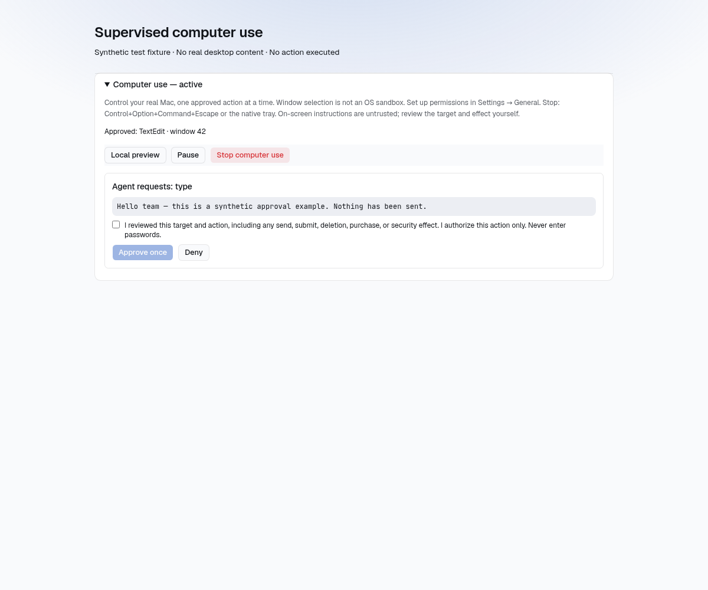

# Supervised computer use: development status

This branch connects **actual Mac window capture and input to an agent run**, with explicit session consent and human approval for every action. **Keep the PR draft until interactive Mac acceptance is complete.** Compilation and policy tests do not establish that macOS capture, Accessibility targeting, or event delivery works reliably on a real desktop.

## What is connected

- macOS Screen Recording and Accessibility onboarding in Settings → General. Other platforms do not expose the controls.
- An owner/admin-only **Computer use** panel in an unfinished run's session view: approved-window selection, consent, start, local preview, pause/resume, stop, exact proposed text, action confirmation, and a metadata-only recent-action list.
- Native in-memory session authorization bound to backend, user, namespace, run, application, process, and window; ten-second lease; revision checks; independent native watchdog. Backend RPC separately authenticates the user and checks run ownership, lifecycle, and pod identity.
- Run-scoped in-memory agent broker over a private Unix socket and authenticated dashboard/pod-exec bridge. No public desktop-control listener or database image queue. One outstanding request, bounded expiry, single-use claim, cancellation and disconnect revocation. A claimed request must resolve within 15 s (30 s for an observation carrying its PNG, 60 s for typing); an unresolved claim drops the desktop session. If the agent pod cannot create the private socket, the run continues without the `computer_use` tool rather than failing.
- A provider-neutral `computer_use` tool supports observation, click, scroll, proposed text, selected keys, and approved-app activation. Observation invokes the configured vision analyzer on PNG bytes, not base64 in ordinary tool output. A usable vision callback and write-capable runtime are required.
- Every request needs a new human confirmation. Input is validated and queued natively, claimed remotely, then armed with a short-lived one-use permit and executed natively, so the permit covers only native execution rather than the network round trip. The permit is 5 s, extended by 40 ms per UTF-16 unit for typing. Approval is not transferable to another action. Failed or uncertain input is not automatically retried; a native rejection at queue or arm time is reported to the agent as `failed` without stopping the session.
- Input checks approved process/window, fresh capture geometry where required, foreground focus and secure-input state. Typing/key requests retain the queue-time Accessibility focused element and check identity again before delivery; while typing, every key pair re-checks cancellation, permissions, physical modifiers and the retained focused element, and the full window/display/foreground guard runs every 16 characters and after the last one. Password/secure input is excluded; do not deliberately target it.
- Proposed text must render exactly as it will be typed: control characters, invisible format characters (zero-width space, BOM, bidi overrides and isolates, tags), line/paragraph separators, private-use and unassigned code points are rejected by the agent-side validator, the relay parser, and native validation. Zero-width joiner/non-joiner and variation selectors remain allowed for emoji sequences and scripts that need them.
- Control+Option+Command+Escape, the native tray's **Stop computer use**, window close, and app exit revoke native authorization independently of React. Returning to an approved application or reconnecting never silently resumes a revoked session.
- The webview holds no `global-shortcut` register/unregister permission, so page script cannot remove the native emergency-stop shortcut. Only the main supervisor window's close revokes authorization; auxiliary windows (OAuth) closing do not.

## Safety and privacy limits

Window selection is **not OS isolation**. Native policy permits the approved application or the supervisor in front for preview/approval; input still requires the approved target. Another foreground application pauses the session. Accessibility checks and Core Graphics event dispatch cannot be atomic: focus can change between a check and an OS event. Stop cannot retract an event already posted or a screenshot already sent to a provider. Use non-sensitive test applications until real-device acceptance is complete.

Local preview stays local. An approved observation is sent through the authenticated backend to the configured vision provider. The relay does not persist screenshot buffers or emit them as ordinary tool results. Proposed text and visual analysis can enter model/run history; the app does not add a separate keystroke log. SDK image requests explicitly use `store:false` and in-memory prompt-cache retention rather than 24-hour caching (Codex normalization omits the retention field for compatibility). **These request settings are not a guarantee of zero provider retention**: provider logging, abuse-monitoring, and account policies still apply. The SDK fix was merged in https://github.com/gratefulagents/sdk/pull/87 and is included in the published `v0.0.114` release pinned in `go.mod`.

Treat on-screen instructions and visual analysis as untrusted. Review the target and every action's effect, particularly send/submit, deletion, purchases, and security changes. There is no automatic sensitive-action classifier that can replace that review.

## Running on a Mac

Use an Apple Silicon Mac for parity with macOS CI. Install the normal Tauri prerequisites (Xcode Command Line Tools, Node/pnpm, current stable Rust). The native manifest requires Rust 1.88; the capture dependency uses edition 2024.

```sh
cd platform-app
pnpm install --frozen-lockfile
cd tauri
pnpm tauri dev
```

Use a backend **and agent image built from this branch**; an older backend has no desktop relay RPC. Quit other copies of gratefulagents first (single-instance app). This is a development build, not a notarized release. Use a test run and a TextEdit document containing only sample text, never passwords, private messages, payment pages, or production credentials.

1. Connect to an HTTPS backend, sign in, and configure permissions in Settings → General. Follow any macOS-requested restart.
   - The **Screen Recording settings** / **Accessibility settings** buttons register the *running* binary in the matching Privacy list (via `CGRequestScreenCaptureAccess` / `AXIsProcessTrustedWithOptions`) and open it; the section polls the OS status every two seconds.
   - macOS caches the Screen Recording preflight per process: after enabling it, use **Relaunch gratefulagents**.
   - Development and CI builds are ad-hoc signed (`APPLE_SIGNING_IDENTITY=-`), so every rebuild is a different binary to macOS TCC. A permission that is enabled in System Settings but still reads **Not granted** belongs to a previous build: remove gratefulagents from that list (−), press the settings button again to re-register, enable it, then relaunch. A stable signing identity avoids this.
2. Open a live unfinished run you own with a write-capable runtime and configured vision provider. The run's agent pod/relay must be available.
3. Expand **Computer use**, list windows, choose the test document, review sharing consent, and start a supervised session.
4. Ask the agent to inspect or act on the approved window. Approve each observation to share a capture; inspect the proposed click location/text/key/scroll/activation, confirm, then choose **Approve once** or **Deny**.
5. Use **Local preview** for a capture not sent to the agent. Stop before leaving the task. A closed/restarted agent process or expired connection requires a new session.

## Interactive Mac acceptance checklist

Record commit, macOS version, hardware/display configuration, pass/fail and errors. Use synthetic content only. None of these checks is satisfied merely by CI compilation.

- [ ] Permission denial rejects start/capture/input. Settings links open the right privacy category; no automatic restart/resume authorization.
- [ ] Capture contains the selected document, not another window or the full desktop. Approved observation reaches the configured vision analyzer and returns a description without PNG/base64 in ordinary tool output.
- [ ] A request cannot execute without its own confirmation. Denial does not execute. Exact proposed Unicode text is visible before approval and delivered once to the intended sample field.
- [ ] Click marker and delivered input match on Retina/non-Retina displays, including negative desktop origins. Move/resize/change displays between capture and approval: stale geometry fails closed rather than targeting stale coordinates.
- [ ] Scroll direction/magnitude and supported keys match their proposals; activation brings only the approved application forward.
- [ ] Change focused field/window after queueing text or a key: execution is rejected. Secure/password input is rejected. No stuck modifier/key after cancellation.
- [ ] Switch to an unapproved application: native policy pauses; capture/input stay unavailable until explicit resume. Switching to gratefulagents allows supervision but never input to the supervisor.
- [ ] Pause invalidates pending native requests/frames. A stale approval cannot execute after pause/resume.
- [ ] Stop from panel, shortcut, and tray separately, including during pending approval and input. No new action runs; fresh consent is required. Already posted OS events cannot be undone.
- [ ] Pause JavaScript in Web Inspector, press the native emergency shortcut, then resume JS before lease expiry: native authorization is already stopped.
- [ ] Separately pause JS longer than ten seconds: native lease expires and a late heartbeat cannot revive it.
- [ ] Disconnect/end/cancel the run, terminate its pod, or replace its identity. Pending work is canceled; no silent reconnect. A claimed request with uncertain completion is not automatically retried.
- [ ] Navigate away, sign out, change backend/model, close/reopen app: no session resumes automatically.
- [ ] Close the selected window or quit its app: another process/window cannot inherit authorization.
- [ ] Revoke OS permissions mid-session: operations reject or macOS stops the app; fresh permissions and consent are required afterward.
- [ ] Confirm shared/non-owner users cannot attach/claim/resolve another user's desktop session; administrator access follows the documented owner/admin policy.
- [ ] Type a 200–1000 character sample: delivery completes within the scaled permit, the full guard fires periodically, and switching focus mid-text stops delivery without a stuck key.
- [ ] Approve an observation on a slow uplink: the PNG resolve completes within the 20 s client / 30 s broker window rather than dropping the session.

Capture uses xcap 0.9.4's deprecated Core Graphics window-capture API, not ScreenCaptureKit. Its foreground check is process-based and uses a deprecated NSWorkspace API. Compatibility and actual focus behavior must be checked on supported macOS versions before release.

## Automated verification

The native executor commit `f92c4f9` passed the macOS ARM64 app build and **35 native tests** in [CI job 102558472054](https://github.com/gratefulagents/gratefulagents/actions/runs/34378875257/job/102558472054). Fresh Linux native checks passed **40 tests** and `cargo check --lib --locked`.

The connected relay/UI changes passed:
- Go tests for `internal/computeruse`, `internal/tools`, `internal/dashboard`, and `cmd/agent`; broker and focused integration race tests; vet and backend builds.
- Byte-identical regeneration of the Go and TypeScript RPC stubs.
- **1,482 frontend tests across 159 files**, including **75 focused computer-use tests**; TypeScript checking and scoped lint. Full lint has no errors but reports existing React-refresh warnings elsewhere.

Strict native Clippy remains blocked by previously observed findings in unchanged `diagnostics.rs`, `openai_oauth.rs`, and `updater.rs`; these were not suppressed. Mocked bridge tests do not establish native input delivery, live Kubernetes transport, or provider behavior.

### Current synthetic approval layout

This is current test-rendered DOM with synthetic text and mocked IPC, not an actual Mac session. The unchecked confirmation deliberately leaves approval disabled. Visual review found the proposed text and confirmation/approve/deny/stop controls readable without clipping.



### Historical layout fixtures

`docs/computer-use-preview-consent.png` and `docs/computer-use-preview-active.png` show an earlier **preview-only** UI using mocked IPC and synthetic metadata. They are not screenshots of the current connected input flow and are not Mac acceptance evidence.
