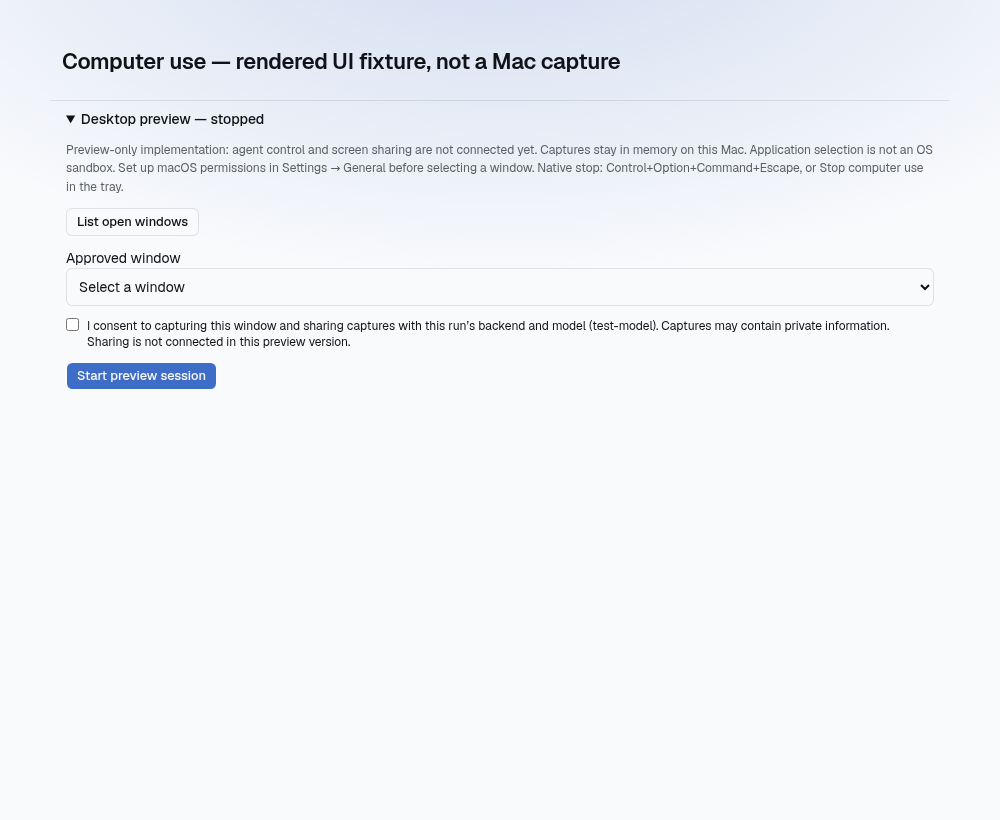
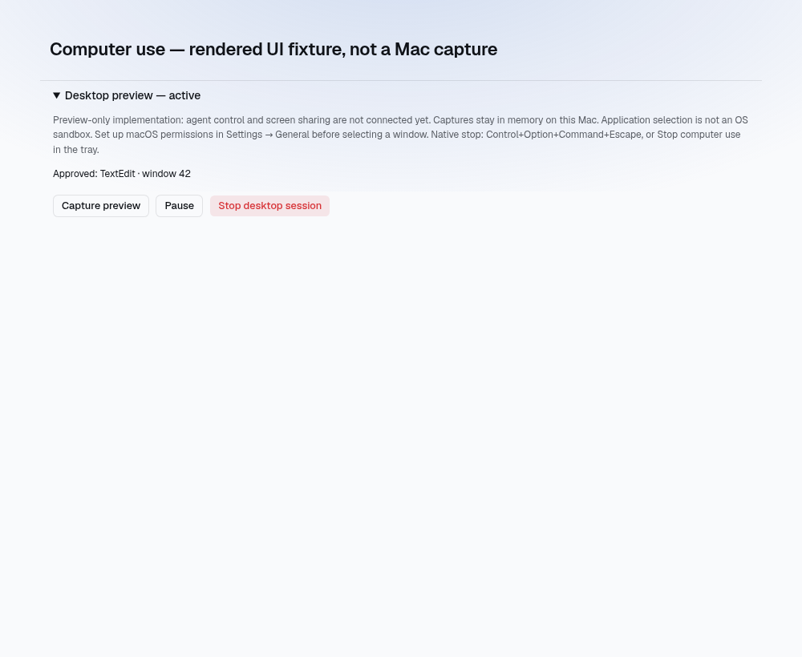

# Supervised computer use: development status

This branch implements **local window preview and native session prerequisites**, not agent desktop control. Keep it a draft until the remaining implementation and Mac acceptance checks are complete.

## What is currently connected

- macOS Screen Recording and Accessibility onboarding in Settings → General.
- An owner/admin-only preview panel in an unfinished run's session view.
- Explicit consent, window selection, start, capture, pause, resume, and stop.
- Native in-memory authorization bound to backend, user, namespace, run, application, process, and window. The local binding is not proof of backend ownership; the UI currently checks run access through the authenticated existing API.
- A ten-second native lease, with heartbeat only after successful run-access checks. Leaving the view, ending the run, changing identity/model, or losing connectivity revokes the local session.
- A native watchdog checks expiry, permissions, and foreground application independently of React. Preview permits the selected application or the supervisor in front; another application pauses it. This is best-effort application policy, **not OS isolation**.
- Control+Option+Command+Escape, the native tray's **Stop computer use**, window close, and app exit revoke native authorization.
- Captures are serialized, and late results are discarded after pause, stop, or expiry. PNG pixels and desktop-point geometry are separate; no input coordinate mapping is implemented yet.

Captures are currently held in memory for local preview. They are not uploaded or written to the application log. The preview does not register a computer-use tool or execute mouse/keyboard input. The frontend's sharing disclosure explicitly says sharing is not connected.

### Rendered UI fixtures

These screenshots use mocked IPC and synthetic window metadata. They verify layout only, not actual Mac capture or native behavior.





## Implementation still required

1. Authenticated, user-owned, run-scoped desktop/agent transport with backend ownership tests, request expiry, deduplication, and disconnect cancellation.
2. Provider-neutral observation/action tools and a verified vision-capability path. The current SDK `ToolResult` carries text, so raw image data must not simply be placed in its text content or persisted as an ordinary tool result.
3. Native click, scroll, text, key, and app-activation primitives, including fresh-frame coordinate validation, secure-input/password exclusion, and foreground checks at execution.
4. A bounded per-action approval queue, action timeline, and sensitive-action confirmations. A model must not authorize its own requests or treat instructions on screen as trusted.
5. Real Mac acceptance, including multi-display/Retina changes and stop during pending work. CI compilation alone is not acceptance.

## Running the development preview on a Mac

Use an Apple Silicon Mac for parity with the current macOS CI target. Install the project's normal Tauri prerequisites (Xcode Command Line Tools, Node/pnpm, and a current stable Rust toolchain). The native manifest now declares Rust 1.88; the new capture dependency uses Rust edition 2024.

From the checked-out branch:

```sh
cd platform-app
pnpm install --frozen-lockfile
cd tauri
pnpm tauri dev
```

Quit any other copy of gratefulagents first: the app is single-instance. This is a development build, not a notarized release. Use a test run and a TextEdit document containing only non-sensitive sample text. Do not use passwords, private messages, payment pages, or production credentials as test content.

In the app, connect to an HTTPS backend, sign in, open an unfinished run you own, and configure the macOS permissions in Settings → General. Return to the run, expand **Desktop preview**, list open windows, select the test document, grant consent, and start the preview session. Capture is manual.

## Interactive Mac acceptance checklist

Record the commit, macOS version, hardware/display configuration, pass/fail for each item, and any error text. Screenshots shared for review must contain only synthetic test content.

- [ ] Permission denial keeps start/capture disabled or rejected. Settings links open the correct privacy category. Follow any macOS-requested app restart; nothing resumes automatically.
- [ ] The selected document appears in the preview. It is the selected window, not the whole desktop or a different application's window.
- [ ] Switch to Finder or another unapproved application. Native policy pauses the session; a subsequent capture is rejected until explicit resume. Returning to the approved app alone does not resume it.
- [ ] Switch between the selected app and gratefulagents. Preview remains usable, as documented. This exception must not become permission to send input to the supervisor.
- [ ] Pause clears the preview and prevents capture; explicit resume is required.
- [ ] Stop using the panel, shortcut, and tray separately. Each stops authorization, clears the preview, and requires fresh consent. Stop cannot undo an already completed operation.
- [ ] With JavaScript temporarily paused in Web Inspector, press the native emergency shortcut and resume JavaScript before the ten-second lease expires. The session must be stopped, demonstrating that the shortcut did not depend on React.
- [ ] In a separate test, pause JavaScript for longer than ten seconds without pressing stop. Resume JavaScript; the lease must be expired and must not revive on a late heartbeat.
- [ ] Disconnect the backend or end the run. No new capture is authorized after native expiry; reconnecting does not silently resume.
- [ ] Close/reopen the app and navigate away from/re-enter the run. No session resumes automatically.
- [ ] Close the selected window or quit its application. Capture fails safely. A different window/process must not inherit authorization.
- [ ] Move/resize the window between Retina and non-Retina displays, including a display with a negative desktop origin. Preview geometry remains coherent or capture fails with a fresh-preview error. This does not validate input coordinate transforms, which remain unimplemented.
- [ ] Revoke OS permission during a session. Capture is rejected or the app is stopped by macOS; after restart, permissions and fresh consent are required.

Capture currently uses xcap 0.9.4's Core Graphics window capture, not ScreenCaptureKit. Its macOS foreground check is process-based and uses a deprecated NSWorkspace API. Compatibility and focus behavior must be checked on supported macOS versions before connecting remote control. Do not treat successful Linux tests or a macOS build as evidence that these runtime checks are reliable.
