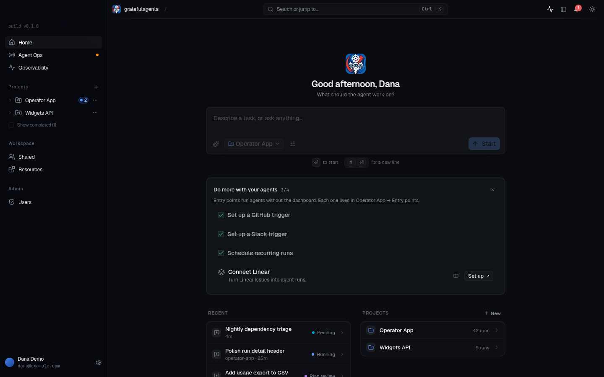

# Retiring bug reports and security scans

This release removes agent bug reports (including bug-squasher runs and maintainer platform-bug publication) and the dedicated security scanning subsystem. Ordinary GitHub issues, PR reviews, the `security-reviewer` role, authentication, authorization, sandbox policy, and generic structured task output remain supported.

## Breaking changes

- Bug-report and security RPCs, dashboard pages, agent tools, and settings are removed. Upgrade clients and workers with the manager; old clients are not compatible with these removed APIs. Removed protobuf field numbers/names are reserved.
- Seven CRDs are retired: `securitytoolruns.platform.gratefulagents.dev`, and `securityscans`, `securityworkflows`, `securityrankers`, `securitypostscripts`, `securitypolicypacks`, and `securityprograms` in `triggers.gratefulagents.dev`.
- The scanner image, Jobs controller, scanner deployment settings, scan-only modes/roles, and 67 security-tagged skills are removed, including chart bootstrap copies. Remove references to these assets from user-owned Projects, AgentRuns, mode templates, and GitOps configuration.
- Generic structured task output uses `platform.gratefulagents.dev/task-output-schema` rather than the retired security annotation.
- Required migration **067** drops 23 feature tables, deletes `security_report` and `security_sarif` session artifacts, restricts artifact kinds to the remaining supported types, and removes scan/program ownership, shares, and notifications. Historical migrations remain unchanged so existing databases can advance normally.

**Migration 067 is destructive and irreversible without a backup. It runs automatically when the new manager starts. There is no down migration. Do not run old managers or old scan/bug-fix workers against the migrated database.** Generic AgentRun sessions, conversation history, and audit logs are retained; they may contain historical references to retired features.

## Deployment procedure (separate operational approval required)

Source removal is not a live cleanup operation. Before deploying:

1. Back up Postgres and inventory/export the seven CRD kinds in every namespace. Inventory installed scan-only Skills, RoleInstructions, ModeTemplates, user references, and scanner Helm values. The removal diff against the previous release is the authoritative shipped-asset inventory; also account for custom or manually installed objects. Capture finding/research artifact object keys and scan report `s3_url` values before their database rows disappear.
2. With the old manager still running, suspend scan schedules/event triggers and stop launching new bug-fix runs. Drain or explicitly cancel existing scan, scanner, and bug-fix AgentRuns under a separately approved operational decision. Scanner Jobs carry `platform.gratefulagents.dev/securitytoolrun`; scan AgentRuns carry `security.gratefulagents.dev/scan-name`, and auto-fix runs carry `platform.gratefulagents.dev/bug-report-id`. Check owner references and descendants as well as labels. Do not infer that deletion of source cancels work or closes PRs.
3. Remove retired custom resources while the old controllers can reconcile deletion. Wait for scan deletion to complete: SecurityScan uses `triggers.gratefulagents.dev/cleanup`. If the old controller cannot run, inspect and clean its dependent runs, Jobs, ConfigMaps, and stored artifacts first; only then remove that finalizer under explicit approval. Do not blindly strip finalizers from active objects. Check for orphaned scanner Jobs, Pods, ConfigMaps, and scan-only secrets after garbage collection.
4. Remove installed scan-only bootstrap resources and references across namespaces, including personal/user namespaces and manually applied assets. Remove retired Helm values and external image build/push automation. Retain generic security controls and `security-reviewer`. Helm upgrades may delete chart-managed templates; manually applied CRDs/resources do not disappear just because they were removed from this repository. Retire CRDs only after draining their instances.
5. Stop all old managers and workers that could access the retired tables. Deploy the new manager and matching workers/clients without overlapping old writers. Allow migration 067 to complete before admitting new work. Validate remaining chat, project, GitHub, and PR-review workflows.
6. Using the captured inventory, separately retire scan staging archives, tool results, reports, PoCs, research/bounty artifacts, and scan-only credentials from object storage/secret stores according to retention and disclosure policy. Database deletion does not delete blob objects. Do not bulk-delete a shared bucket or credentials used by ordinary runs.

Rollback requires restoring a coordinated pre-retirement database/object/resource backup and the old application version. Reinstalling the old binary alone cannot restore dropped records.

No deployment, CR deletion, finalizer removal, cancellation, external PR mutation, or live artifact deletion is performed by this source change.

## UI verification

The self-development browser smoke test renders the home page without the retired navigation entries and reports no console, page, or network errors.

